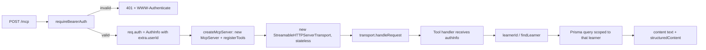
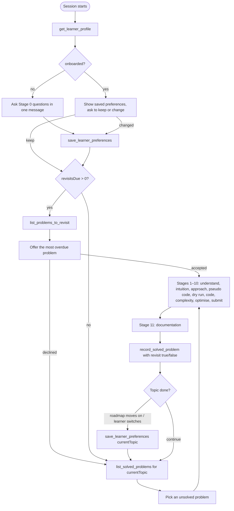
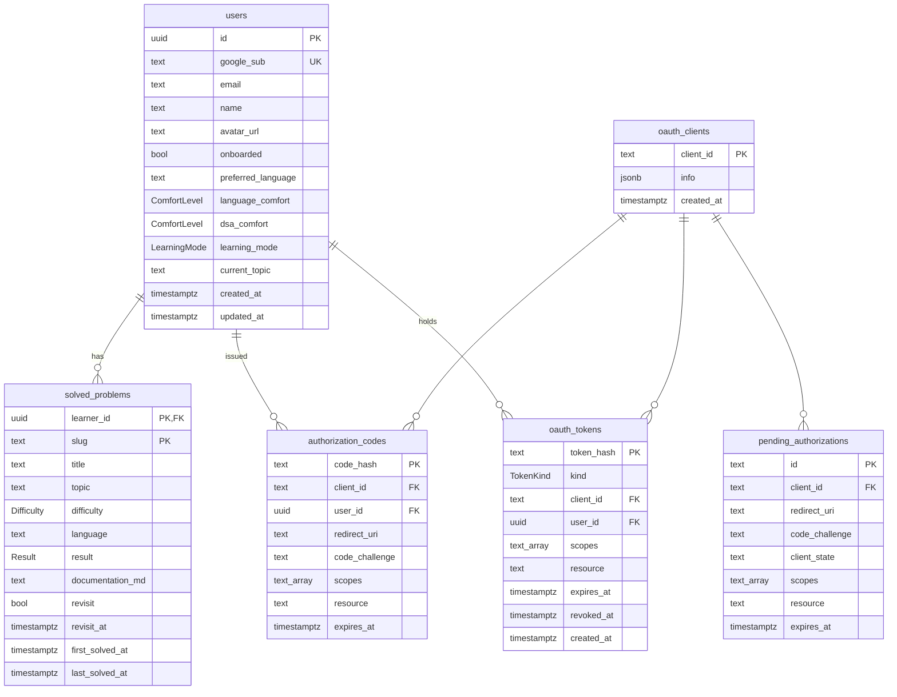

# Project Description: DSA Tutor Skill + DSA Progress MCP Server

## 1. Overview

This repository has two parts that work together:

| Part | Path | What it is |
|---|---|---|
| **DSA Learning Skill** | [dsa-learning-skill/](dsa-learning-skill/) | A Claude skill (`SKILL.md`) that acts as a strict, stage-by-stage DSA tutor. It coaches the learner through a problem (Stage 0 setup → Stage 11 documentation) and never gives away the solution. |
| **DSA Progress MCP** | [dsa-progress-mcp/](dsa-progress-mcp/) | A remote MCP server (Streamable HTTP) that gives the skill memory across sessions: who the learner is, their saved preferences, which problems they've solved, and which ones are due for a revisit. |

Without the MCP server the skill is stateless and starts from zero every conversation. With it, the tutor can greet a returning learner, skip the setup questions it already has answers to, avoid repeating solved problems, and bring back problems the learner wanted to revisit.

```
┌──────────────┐   tool calls (JSON-RPC over HTTP)   ┌──────────────────────┐     ┌────────────┐
│ Claude +     │ ──────────────────────────────────▶ │ dsa-progress-mcp     │ ──▶ │ PostgreSQL │
│ DSA skill    │ ◀────────────────────────────────── │ (Express + MCP SDK)  │ ◀── │ (Prisma 7) │
└──────────────┘      Bearer access token           └──────────┬───────────┘     └────────────┘
                                                               │ sign-in only
                                                               ▼
                                                        ┌─────────────┐
                                                        │ Google OAuth│
                                                        └─────────────┘
```

---

## 2. Tech Stack

| Concern | Choice |
|---|---|
| Language / runtime | TypeScript (ESM, `nodenext`), Node.js ≥ 20.6 |
| HTTP | Express 5, via the MCP SDK's `createMcpExpressApp` |
| MCP | `@modelcontextprotocol/sdk` — `McpServer` + `StreamableHTTPServerTransport` (stateless) |
| Auth | The server is its own OAuth 2.1 authorization server (SDK `mcpAuthRouter`); Google is used only to identify the user (`google-auth-library`) |
| Validation | Zod 4 (env config, tool input and output schemas) |
| Database | PostgreSQL 16 (Docker Compose), Prisma 7 with the `@prisma/adapter-pg` driver adapter |
| Tests | Node's built-in `node:test` + PGlite (in-memory Postgres), so Docker isn't needed |

---

## 3. Directory Structure

```
dsa-progress-mcp/
├── src/
│   ├── index.ts                  # Entry point: load config, create Prisma + app, listen, graceful shutdown
│   ├── app.ts                    # Express app: /health, OAuth routes, bearer auth, POST /mcp, error handler
│   ├── server.ts                 # Creates an McpServer and registers all tools
│   ├── config.ts                 # Zod-validated environment variables
│   ├── db/db.ts                  # PrismaClient factory (pg driver adapter)
│   ├── auth/
│   │   ├── provider.ts           # DsaOAuthProvider: clients, codes, tokens (hashed), verification
│   │   ├── routes.ts             # /oauth/google/callback and /oauth/cancel
│   │   ├── google.ts             # Google sign-in wrapper (auth URL + ID-token verification)
│   │   └── pages.ts              # HTML login and error pages
│   ├── tools/
│   │   ├── index.ts              # registerTools(): wires every tool onto the server
│   │   ├── schema.ts             # Zod input/output schemas for all tools
│   │   ├── learner-id.ts         # learnerId(authInfo), findLearner(prisma, authInfo)
│   │   ├── get-learner-profile.ts
│   │   ├── save-learner-preferences.ts
│   │   ├── list-solved-problems.ts
│   │   ├── record-solved-problem.ts
│   │   └── list-problems-to-revisit.ts
│   ├── utils/
│   │   ├── errors.ts             # AppError hierarchy + toAppError/handleError
│   │   └── tool-error.ts         # withToolErrors(): turns thrown errors into MCP tool errors
│   └── generated/prisma/         # Prisma client output (generated, do not edit)
├── prisma/
│   ├── schema.prisma
│   └── migrations/               # SQL migrations, applied in timestamp order
├── tests/                        # auth.test.ts, mcp.test.ts, errors.test.ts, helpers.ts
├── postman/                      # Postman collection (setup + error cases)
├── docker-compose.yml            # Postgres 16
├── prisma.config.ts
└── .env.example

dsa-learning-skill/
├── SKILL.md                      # The tutor's rules and Stages 0–11
└── references/
    ├── roadmap.md                # Topic order used when learningMode = roadmap
    └── documentation-example.md  # Example of the Stage 11 write-up
```

---

## 4. Configuration

Environment variables are parsed in [src/config.ts](dsa-progress-mcp/src/config.ts). The process refuses to start if any are invalid.

| Variable | Required | Default | Purpose |
|---|---|---|---|
| `DATABASE_URL` | yes | — | Postgres connection string |
| `HOST` | no | `127.0.0.1` | Interface to bind to |
| `PORT` | no | `3333` | Port to listen on |
| `PUBLIC_URL` | no | `http://localhost:$PORT` | Public base URL. It is the OAuth issuer, the base of `/mcp`, and the base of the Google redirect URI. Trailing slashes are stripped. |
| `GOOGLE_CLIENT_ID` | yes | — | Google OAuth client (type "Web application") |
| `GOOGLE_CLIENT_SECRET` | yes | — | Its secret |

The Google client must list `$PUBLIC_URL/oauth/google/callback` as an authorized redirect URI.

---

## 5. HTTP API Surface

Every route the server exposes:

| Method | Path | Auth | Served by | Purpose |
|---|---|---|---|---|
| GET | `/health` | none | `app.ts` | Runs `SELECT 1`. Returns `{status:"ok"}`, or `503 {status:"db_unavailable", error}` |
| GET | `/.well-known/oauth-protected-resource/mcp` | none | SDK `mcpAuthRouter` | Protected resource metadata (RFC 9728): which authorization server protects `/mcp` |
| GET | `/.well-known/oauth-authorization-server` | none | SDK | Authorization server metadata (RFC 8414) |
| POST | `/register` | none | SDK → `PrismaClientsStore` | Dynamic client registration (RFC 7591) |
| GET/POST | `/authorize` | none | SDK → `DsaOAuthProvider.authorize` | Starts sign-in; shows the login page |
| POST | `/token` | client auth | SDK → provider | `authorization_code` (with PKCE) and `refresh_token` grants |
| POST | `/revoke` | client auth | SDK → provider | Revokes an access or refresh token |
| GET | `/oauth/google/callback` | state cookie | `auth/routes.ts` | Google returns here; creates/updates the learner and redirects to the client with a code |
| GET | `/oauth/cancel` | state cookie | `auth/routes.ts` | "Cancel" on the login page; redirects to the client with `access_denied` |
| POST | `/mcp` | **Bearer token** | `app.ts` | The MCP endpoint (JSON-RPC 2.0) |
| GET / DELETE | `/mcp` | Bearer token | `app.ts` | `405 method_not_allowed` (stateless server, no SSE stream or sessions) |

The SDK rate-limits the OAuth endpoints. Tests turn this off with `rateLimitAuth: false`.

---

## 6. Authentication Flow

The server is a full OAuth 2.1 authorization server for its own `/mcp` resource. Google only answers the question "who is this person?". The MCP client never sees a Google token.

```mermaid
sequenceDiagram
    autonumber
    participant C as MCP client (Claude Code)
    participant S as dsa-progress-mcp
    participant B as Browser
    participant G as Google
    participant DB as Postgres

    C->>S: POST /mcp (no token)
    S-->>C: 401 + WWW-Authenticate (resource_metadata URL)
    C->>S: GET /.well-known/oauth-protected-resource/mcp
    C->>S: GET /.well-known/oauth-authorization-server
    C->>S: POST /register
    S->>DB: insert oauth_clients
    C->>B: open /authorize?client_id&redirect_uri&code_challenge&state&resource
    B->>S: GET /authorize
    S->>DB: delete expired pending_authorizations, insert new one (id = random state)
    S-->>B: login page + Set-Cookie dsa_oauth_state (httpOnly, path=/oauth, 10 min)
    B->>G: "Continue with Google" (state = pending id)
    G-->>B: redirect /oauth/google/callback?code&state
    B->>S: GET /oauth/google/callback (+ cookie)
    S->>S: state must equal cookie (timing-safe); pending row deleted (single use, not expired)
    S->>G: exchange code, verify ID token (audience, email_verified)
    S->>DB: upsert users by google_sub (refresh email/name/avatar)
    S->>DB: insert authorization_codes (SHA-256 hash, 1 min TTL)
    S-->>B: 302 redirect_uri?code&state
    B-->>C: code
    C->>S: POST /token (grant_type=authorization_code, code_verifier)
    S->>DB: PKCE check; delete code (single use); insert access + refresh token hashes
    S-->>C: access_token (1 h) + refresh_token (30 d)
    C->>S: POST /mcp  Authorization: Bearer <access_token>
    S->>DB: verifyAccessToken → authInfo.extra.userId
```

### Lifetimes

| Item | TTL | Stored as |
|---|---|---|
| Pending authorization (and the state cookie) | 10 minutes | Plain id (it is the Google `state`) |
| Authorization code | 1 minute, single use | SHA-256 hash |
| Access token | 1 hour | SHA-256 hash |
| Refresh token | 30 days, rotated on every use | SHA-256 hash |

### Security properties

- **Hashed secrets.** Codes and tokens are stored only as SHA-256 hashes, so a database leak doesn't hand out working credentials.
- **PKCE** is required. The SDK compares the `code_verifier` against `challengeForAuthorizationCode`.
- **Single-use codes.** `exchangeAuthorizationCode` deletes the row first, so two concurrent exchanges can't both succeed.
- **Refresh rotation.** The old refresh token is revoked (`updateMany ... revokedAt: null, expiresAt > now`) before a new pair is issued. If that updates 0 rows, the grant fails.
- **Browser binding.** The callback's `state` must match the `dsa_oauth_state` cookie, so a callback link opened in another browser can't finish someone else's sign-in.
- **Resource binding.** `/authorize` rejects any `resource` other than this server's `/mcp` URL, and token exchange/refresh must match the original resource.
- **Verified email only.** Google accounts without a verified email get `403`.
- **Login/error pages** set `Cache-Control: no-store`, a strict CSP, `X-Frame-Options: DENY`, `no-referrer`, and HTML-escape the client name.
- **Kinds are checked.** A refresh token presented as a Bearer token is rejected, and vice versa.

### Failure paths

| Situation | Result |
|---|---|
| User declines at Google or clicks Cancel | 302 to client `redirect_uri` with `error=access_denied` and the client's `state` |
| Missing/mismatched state cookie, or expired/replayed pending authorization | HTML error page, 400 |
| Google code exchange fails | HTML error page, 502 `upstream_error` |
| Unverified Google email | HTML error page, 403 `forbidden` |
| Bad, expired or revoked Bearer token on `/mcp` | 401 with `WWW-Authenticate` (from the SDK's `requireBearerAuth`) |

---

## 7. MCP Request Lifecycle

`/mcp` runs in **stateless mode**: every POST builds a fresh `McpServer` and `StreamableHTTPServerTransport` (`sessionIdGenerator: undefined`), handles the one JSON-RPC message, and closes both when the response closes. No session is kept between calls; all state lives in Postgres.



The learner is always taken from the token (`authInfo.extra.userId`), never from tool arguments. One learner can't read or write another learner's data.

---

## 8. MCP Tools

All tools are registered in [src/tools/index.ts](dsa-progress-mcp/src/tools/index.ts), and their schemas live in [src/tools/schema.ts](dsa-progress-mcp/src/tools/schema.ts). Every tool returns the same data twice: as pretty-printed JSON in `content[0].text` and as `structuredContent` that matches its `outputSchema`.

### 8.1 `get_learner_profile`

Loads the signed-in learner. The skill calls it first in every session, before saying anything.

- **Input:** none
- **Annotations:** `readOnlyHint`
- **Logic:** find learner by id; count all solved problems; count problems with `revisit = true AND revisit_at <= now`.
- **Output:**

```json
{
  "name": "Asha",
  "onboarded": true,
  "totalSolved": 12,
  "revisitsDue": 2,
  "preferences": {
    "language": "Python",
    "languageComfort": "intermediate",
    "dsaComfort": "beginner",
    "learningMode": "roadmap",
    "currentTopic": "Sliding Window"
  }
}
```

- **Errors:** learner row missing → tool error "No learner account was found for this sign-in. Sign in again."

### 8.2 `save_learner_preferences`

Saves Stage 0 answers or any later change, and sets `onboarded = true`. Only the fields passed are updated.

- **Annotations:** `idempotentHint`, `openWorldHint: false`
- **Input** (all optional; at least one is required):

| Field | Type | Notes |
|---|---|---|
| `preferredLanguage` | string (trimmed, non-empty) | e.g. `Python` |
| `languageComfort` | `beginner` \| `intermediate` \| `advanced` | |
| `dsaComfort` | `beginner` \| `intermediate` \| `advanced` | |
| `learningMode` | `roadmap` \| `topic` | `roadmap` follows `references/roadmap.md`; `topic` stays on a topic the learner chose |
| `currentTopic` | string (trimmed, non-empty) | e.g. `Sliding Window`. New solved problems are filed under it. |

- **Output:** `{ onboarded, preferences: { preferredLanguage, languageComfort, dsaComfort, learningMode, currentTopic } }`
- **Errors:** no fields → `400 bad_request` "Pass at least one preference to save."

### 8.3 `list_solved_problems`

Lists the problems solved **in the current topic**, most recently solved first. The skill calls it before picking a new problem so a solved one is never given again.

- **Input:** none
- **Annotations:** `readOnlyHint`
- **Output:**

```json
{
  "topic": "Sliding Window",
  "count": 1,
  "problems": [
    {
      "slug": "longest-substring-without-repeating-characters",
      "title": "Longest Substring Without Repeating Characters",
      "difficulty": "medium",
      "language": "Python",
      "result": "accepted",
      "revisit": false,
      "firstSolvedAt": "2026-09-27T10:00:00.000Z",
      "lastSolvedAt": "2026-09-27T10:00:00.000Z"
    }
  ]
}
```

- **Errors:** no `currentTopic` saved → `400 bad_request`.

### 8.4 `record_solved_problem`

Saves a finished problem under the learner's current topic. The skill calls it after the Stage 11 documentation.

- **Annotations:** `idempotentHint`
- **Input:**

| Field | Type | Notes |
|---|---|---|
| `title` | string (trimmed, non-empty) | Use exactly the same title when recording a revisit |
| `difficulty` | `easy` \| `medium` \| `hard` | |
| `language` | string (trimmed, non-empty) | Language it was solved in |
| `result` | `accepted` \| `partial` \| `not_solved` | |
| `documentationMd` | string (non-empty) | Full Stage 11 documentation in Markdown |
| `revisit` | boolean, default `false` | `true` schedules a revisit 7 days from now; `false` clears any scheduled revisit |

- **Logic:**
  1. Load the learner; require `currentTopic`.
  2. `slug = slugify(title)`: lowercase, runs of non-alphanumerics become `-`, leading/trailing `-` trimmed. So `"Two Sum II - Input Array Is Sorted"` becomes `two-sum-ii-input-array-is-sorted`.
  3. Upsert on the primary key `(learner_id, slug)`:
     - **create:** all fields, plus `topic = currentTopic`.
     - **update:** all fields except `topic` and `firstSolvedAt`, which keep their original values. `lastSolvedAt` moves forward automatically (`@updatedAt`).
  4. `revisitAt = now + 7 days` if `revisit`, else `null`.
- **Output:** `{ slug, title, topic, difficulty, language, result, revisit, revisitAt, firstSolvedAt, lastSolvedAt }`
- **Errors:** no `currentTopic` → `400`; title with no letters or digits → `400`.

### 8.5 `list_problems_to_revisit`

Lists **every** problem marked for revisit, across all topics (the topic may have moved on before the due date arrives). Ordered by `revisitAt` ascending (nulls last), then `lastSolvedAt` ascending.

- **Input:** none
- **Annotations:** `readOnlyHint`, `openWorldHint: false`
- **Output:**

```json
{
  "count": 1,
  "problems": [
    {
      "slug": "minimum-window-substring",
      "title": "Minimum Window Substring",
      "topic": "Sliding Window",
      "difficulty": "hard",
      "result": "partial",
      "revisitAt": "2026-09-25T10:00:00.000Z",
      "due": true,
      "lastSolvedAt": "2026-09-18T10:00:00.000Z"
    }
  ]
}
```

`due` is `true` once `revisitAt <= now`. Problems that are marked but not yet due are included too, with `due: false`.

---

## 9. End-to-End Learning Flow (Skill ↔ Tools)

How a tutoring session uses the API:



Revisit loop: recording with `revisit: true` sets `revisit_at = now + 7d`. Seven days later `get_learner_profile.revisitsDue` counts it, and the skill offers it again. Recording the same title again updates the same row. Passing `revisit: false` at that point clears it from the list.

---

## 10. Data Model

Defined in [prisma/schema.prisma](dsa-progress-mcp/prisma/schema.prisma).



**Enums:** `Difficulty` (easy, medium, hard) · `Result` (accepted, partial, not_solved) · `ComfortLevel` (beginner, intermediate, advanced) · `LearningMode` (roadmap, topic) · `TokenKind` (access, refresh)

**Notes**

- The Prisma model `Learner` maps to the `users` table.
- `solved_problems` has a composite primary key `(learner_id, slug)`, so one row per problem per learner. Recording again updates it.
- Indexes: `solved_problems(learner_id, topic)` serves `list_solved_problems`; `(learner_id, revisit, revisit_at)` serves the revisit queries; `oauth_tokens(user_id)`.
- All foreign keys `ON DELETE CASCADE`. Deleting a learner removes their problems, codes and tokens; deleting a client removes its pending authorizations, codes and tokens.

### Migration history

| Migration | Change |
|---|---|
| `20260927000000_init` | `solved_problems` with a UUID id, platform fields and complexity columns |
| `20260927095044_add_retry_problem` | `retry_problem` flag and `revisit_at` |
| `20260927120000_add_google_auth` | `users`, `oauth_clients`, `pending_authorizations`, `authorization_codes`, `oauth_tokens` |
| `20260928053220_onboard_field_added_learner` | `users.onboarded` boolean |
| `20260928090000_add_learner_preferences` | Preference columns (text) and `learning_goal` |
| `20260928120000_learner_schema_v2` | UUID ids; enums for comfort and learning mode; `current_topic`; `solved_problems` composite key; dropped platform/complexity/`retry_problem`; `first_solved_at` / `last_solved_at` |
| `20260928130000_add_revisit_flag` | `solved_problems.revisit` boolean |

---

## 11. Error Handling

Defined in [src/utils/errors.ts](dsa-progress-mcp/src/utils/errors.ts). An `AppError` carries a user-safe `message`, an HTTP `status`, and a stable `code`. Anything else that's thrown is treated as internal: it's logged, and the caller only sees a generic message.

| Class | Status | Code |
|---|---|---|
| `BadRequestError` | 400 | `bad_request` |
| `UnauthorizedError` | 401 | `unauthorized` |
| `ForbiddenError` | 403 | `forbidden` |
| `NotFoundError` | 404 | `not_found` |
| `MethodNotAllowedError` | 405 | `method_not_allowed` |
| `ConflictError` | 409 | `conflict` |
| `InternalError` | 500 | `internal_error` |
| `UpstreamError` | 502 | `upstream_error` |
| `ServiceUnavailableError` | 503 | `service_unavailable` |

`toAppError` also maps library errors:

- Prisma `P2025` (record not found) → 404
- Prisma `P2002` (unique violation) → 409
- Prisma `P1001` / `P1002` / `P2024` and initialization errors → 503
- Express 4xx errors marked `expose` (e.g. malformed JSON) → the same status
- Anything else → 500 `internal_error`

`handleError(scope, err)` converts the error and logs it with `console.error` only when it's a 5xx.

**How errors reach the caller**

| Where | Shape |
|---|---|
| Inside a tool (`withToolErrors`) | A normal MCP result with `isError: true`, text `"<message> (<code>, status <n>)"`, and `_meta.error = { code, status, message }` |
| `/mcp` transport-level failure, bad JSON body, 405 | JSON-RPC error `{ jsonrpc: "2.0", error: { code: -32000 (4xx) / -32603 (5xx), message, data: {code,status,message} }, id: null }` with the matching HTTP status |
| Other non-MCP routes | `{ error: { code, status, message } }` |
| OAuth browser routes | HTML error page |

---

## 12. Running Locally

```bash
cd dsa-progress-mcp
npm install                # also runs prisma generate
cp .env.example .env       # fill in GOOGLE_CLIENT_ID and GOOGLE_CLIENT_SECRET
npm run db:up              # Postgres 16 via docker compose
npm run db:migrate         # prisma migrate deploy
npm run dev                # http://localhost:3333/mcp (tsx watch)
```

Register with Claude Code. No header is needed; the browser opens for sign-in on first use:

```bash
claude mcp add --transport http dsa-progress http://localhost:3333/mcp
```

Use `localhost`, not `127.0.0.1`, so the URL matches `PUBLIC_URL`.

| Script | What it does |
|---|---|
| `npm run dev` | Watch mode with `tsx` |
| `npm run build` / `npm start` | Compile to `dist/` and run it |
| `npm run typecheck` | `tsc --noEmit` |
| `npm test` | All `tests/**/*.test.ts` |
| `npm run db:migrate:dev -- --name <change>` | Create a new migration after editing the schema |

Shutdown: `SIGINT`/`SIGTERM` close the HTTP server and disconnect Prisma.

---

## 13. Testing

Tests start an in-memory Postgres (PGlite) behind a wire-protocol socket, apply the real SQL migrations in order, and point Prisma at it with a pool size of 1. Google is replaced by a fake `GoogleSignIn`. OAuth rate limiting is off.

| File | Covers |
|---|---|
| `tests/auth.test.ts` | Discovery (401 + metadata), login page (client name escaping, wrong resource), Google callback (learner create/reuse, state echo, missing cookie, replay, decline, cancel, Google failure), tokens (work on `/mcp`, stored hashed, wrong PKCE verifier, single-use code, code from another client, refresh rotation, revoked/expired, refresh-as-access) |
| `tests/mcp.test.ts` | Connection with and without a token; `get_learner_profile` (onboarded and new learner); all progress tools (topic required, preferences saved, record + update by title, list per topic newest-first, revisit ordering); 405 on GET; 400 on malformed body; `/health` |
| `tests/errors.test.ts` | `toAppError` mapping and `withToolErrors` not leaking internal messages |

---

## 14. Known Gaps

Things found while writing this document that are worth fixing:

1. **`SKILL.md` is out of date with the server.** It still lists a `get_solved_problem` tool (which doesn't exist), `learningGoal` and `language` as preference fields (the server uses `learningMode`, `currentTopic`, `preferredLanguage`), `retryProblem` (now `revisit`), `email`/`onboardedAt` in the profile example, and a `topic` argument plus per-topic counts for `list_solved_problems`/`record_solved_problem` (the server takes the topic from `currentTopic`). Tool calls that follow the current skill text will send fields the server ignores or rejects.
2. **The schema and migrations disagree on a revisit index.** `schema.prisma` declares `@@index([learnerId, revisit, revisitAt])`, but the migrations only create `solved_problems_learner_id_revisit_at_idx` on `(learner_id, revisit_at)`. Running `npm run db:migrate:dev` will generate a migration to fix this.
3. **`get_learner_profile` isn't wrapped in `withToolErrors`**, unlike the other four tools. A database failure there surfaces differently, and its "not found" result has no `code`/`status` metadata. Using `findLearner` + `withToolErrors` would make it consistent.
4. **The README lists only `get_learner_profile`** under Tools.
5. **`tsconfig.json` includes `drizzle.config.ts`**, a leftover from before the move to Prisma.
